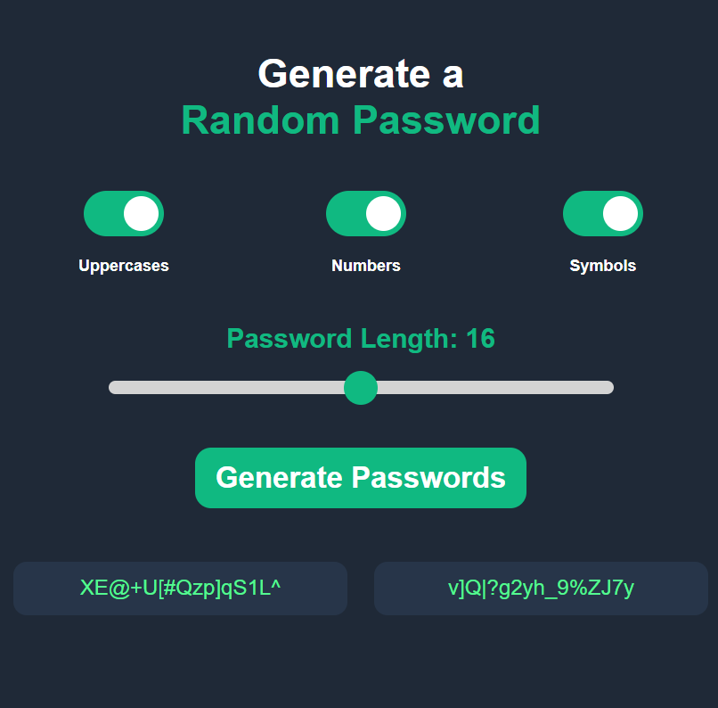

## Password Generator Browser Extension

This extension generates random passwords of different lengths ranging from 8 to 24 characters

## Features

- Generates secure and reliable passwords from 8 to 24 characters
- Easy-to-use interface
- Click on the generated password to copy it to your clipboard

## Installation

1. Download the folder from GitHub
2. Unzip the downloaded package if needed
3. Open Chrome and navigate to the Extensions settings (chrome://extensions/)
4. Enable Developer Mode in the top right corner
5. Click on the "Load unpacked" button in the top left corner
6. Navigate to the extension's path and select it

The Password Generator extension is now ready to be used.
